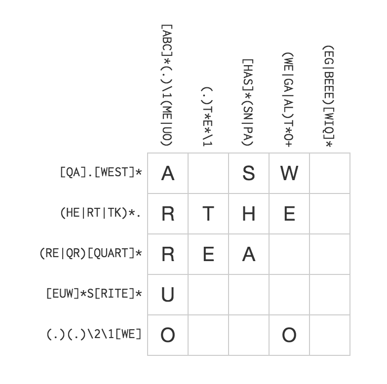

# Regex 101

<p style="text-align: center;">Henry Marshall (@henry)</p>
<p style="text-align: center;">2018-04-09</p>

==========


## Simple String Replacement

It would be grand if grandma came over!

```sed
%s/grand/super/
```

It would be super if superma came over!

----------

## A Work Around

It would be grand if grandma came over!

```sed
%s/ grand / super /
```

It would be super if grandma came over!

----------

## Your First Regex

It would be grand if grandma came over!

If grandma came over that would be grand!

```sed
%s/grand\b/super/
```

It would be super if grandma came over!

If grandma came over that would be super!

----------

## What Happened

`\b` matches the boundary between a letter, number, or underscore and anything else.

`/foo\b/`

Matches:
```plaintext
foo.
foo()
foo-
foo bar
foo
```

Does *not* Match:
```plaintext
foobar
foo1
foo_
```

==========

## Character Class

My grandma has a cat.
My grandpa has a dog.

`%s/grand[mp]a/family/`

My family has a cat.
My family has a dog.

----------

## Shorthand Character Class

| Shorthand | Equivalent      |
| --------- | --------------- |
| `[0-9]`   | `[0123456789]`  |
| `\d`      | `[0-9]`         |
| `\s`      | `[ \t\n\r]`     |
| `\w`      | `[\A-Za-z\d_]`  |

Note: I can (and did) use `\d` inside another character class!

----------

## Negation

Negate a character class by prepending `^`

```js
const isNotVowel = str => /[^aeiou]/.test(str)
```

| Shorthand | Equivalent |
| --------- | ---------- |
| `\D`      | `[^\d]`    |
| `\S`      | `[^\s]`    |
| `\W`      | `[^\w]`    |

==========

## Metacharacters

There are 12 characters with a special meaning:

```plaintext
\ ^ $ . | ? * + ( ) [ {
```

- Metacharacters are context dependent.

- To match a literal character, escape it with a backslash `\$`.

- In character classes, *usually* treated literally

Note:
- `?` and `^` are the most context dependent.
- You *may* escape in character classes.

----------

## Checking Uptime

```js
const isFiveNines = str => /99\.999/.test(str)

const goodUptime = "99.99939"
isFiveNines(goodUptime)  // true

const badUptime = "93.990999"
isFiveNines(badUptime)   // false
```

In practice you should be comparing floats.

----------

## Incorrect Regex Fail Silently (usually)

```js
const isFiveNines = str => /99.999/.test(str)

const badUptime = "93.990999"
isFiveNines(terribleUptime) // true - oh no!
```

The `.` matches any one character in regex (with the exception of `\n`).

==========

## Repeating Characters

| Pattern | Description             | Matches                      |
| ------- | ----------------------- | ---------------------------- |
| a?      | One or Zero 'a'         | '' 'a'                       |
| a\*     | Zero or More 'a'        | '' 'a' 'aa' 'aaa' 'aaaa'...  |
| a+      | One or More 'a'         | 'a' 'aa' 'aaa' 'aaaa'...     |
| a{3}    | Exactly three 'a'       | 'aaa'                        |
| a{2,4}  | Two to four 'a'         | 'aa' 'aaaa' 'aaaa'           |

Note: Omitting the first and second numbers implicitly means 0 and infinite respectively.

----------

## Matching Account IDs

```js
const isChargeId = str => /acct_[a-zA-Z0-9]{16,}/.test(str)
```

Note: Can anyone tell me why I didn't used `\w+`

==========

## Groups

Treating a sequence as a single atomic unit.

```js
const isTheme = str => /(na)+ batman/i.test(str)
isTheme("nanananananana Batman!")     // true
```

----------

## Alternation in Groups

My brother has a cat.
My sister has a dog.

`%s/(brother|sister)/family/`

My family has a cat.
My family has a dog.

----------

## Capture Groups

```js
const str = "Sticker pricing is 2.9% + $0.30 per transaction"
const getPercentage = str.match(/(100|\d{1,2}(?:\.\d+)?)%/)
getPercentage(str)[1]       // "2.9"
```

----------

## Backreferences

My brother has a goldfish.

`%s/(brother|sister)/step-\1/`

My step-brother has a goldfish.

Note: Backreferences are 1-indexed

==========

## Matching Email Addresses

```plaintext
/^[A-Z0-9._%+-]+@[A-Z0-9.-]+\.[A-Z]{2,}$/i
```

| Section          | Meaning                                         |
| ---------------- | ----------------------------------------------- |
| `^`              | Start of the line                               |
| `[A-Z0-9._%+-]+` | 1+ of: letter, number, `.`, `_`, `%`, `+`, `-`  |
| `@`              | Literal `@`                                     |
| `[A-Z0-9.-]+`    | 1+ of: letter, number, `.`, `-`                 |
| `\.`             | Literal `.`                                     |
| `[A-Z]{2,}`      | Two or more letters                             |
| `$`              | End of the line                                 |
| `i`              | Case Insensitive                                |

Note: 
- Escaping metacharacters was unnecessary inside char class.
- Not uncommon for regex to reject my personal email.

----------

## Ruby Security Vulnerability!

```ruby
reg = /^\w+(\+\w+)?@\w+\.\w{2,}$/
reg.match("foo bar")
# => nil

reg.match("foo@bar.com")
# => <MatchData "foo@bar.com" 1:nil>

reg.match("<script>alert('uh oh')</script>\nfoo@bar.com")
# => <MatchData "foo@bar.com" 1:nil>
```

----------

## Ruby Safe Regex

Use `\A` (start of string) and `\z` (end of string),
instead of `^` (start of *line*) and `$` (end of *line*).

```ruby
safeReg = /\A\w+(\+\w+)?@\w+\.\w{2,}\z/

reg.match("foo@bar.com")
# => <MatchData "foo@bar.com" 1:nil>

reg.match("<script>alert('uh oh')</script>\nfoo@bar.com")
# => nil
```

The linter has got your back.


----------

## Match only what you need

```ruby
foo = 'foo: "foo"'
/"(.+)"/.match(config)[1]     # => "foo"

foobar = 'foo: "foo", bar: "bar"'
/"(.+)"/.match(foobar)[1]     # => "foo\", bar: \"bar"
/"([^"]+)"/.match(foobar)[1]  # => "foo"
```

Note: You can make the regex engine lazy with `?`


----------

## Matching All the Things!

```ruby
extract_comment = /\/\*([\w\W]+)\*\//
contains_comment = "this.bit.is.code()
/* this is a comment
this too */
more.code()"
extract_comment.match(contains_comment)[1].strip
# => "this is a comment\nthis too"
```

This is what [your](https://github.com/mooz/js2-mode/blob/master/js2-mode.el#L6160) [syntax](https://github.com/isagalaev/highlight.js/blob/master/src/highlight.js#L756) [highlighter](https://github.com/pangloss/vim-javascript/blob/master/syntax/javascript.vim#L202) [is](https://github.com/Benvie/JavaScriptNext.tmLanguage/blob/master/JavaScriptNext.tmLanguage#L70) [doing](https://github.com/atom/language-javascript/blob/master/grammars/javascript.cson#L1890)!


----------

## [Parsing HTML](https://stackoverflow.com/questions/1732348/regex-match-open-tags-except-xhtml-self-contained-tags)


----------

## Flavors of Regex

- Backreferences are by either:
  - `$1 $2` (Ruby, Rust, PHP, Java)
  - `\1 \2` (Javascript, Python)
  - `%1 %2` (Clojure)
- Basics are ~universal across languages
- Some advanced features vary (e.g., lookarounds, named references)

----------

## Use a library with Javascript

```javascript
"bar baz".match(/ba\w/)    // [ "bar", index: 0, input: "bar baz" ]
"bar baz".match(/ba(\w)/)  // [ "bar", "r", index: 0 input "bar baz" ]
"bar baz".match(/ba\w/g)   // [ "bar", "baz" ]
"bar baz".match(/ba(\w)/g) // [ "bar", "baz" ]
"bar baz".match(/foo/)     // null
"bar baz".match(/foo/g)    // null

// The "correct" way to capture globally.
var matches, output = [];
while (matches = /ba(\w)/.exec("bar baz")) {
  output.push(matches[1]);
}
```

==========

## Next Steps

- [Lookarounds](https://www.regular-expressions.info/lookaround.html)
- [Laziness](https://www.regular-expressions.info/repeat.html)


----------

## Regex Crosswords



----------

## [Regex Golf](https://www.oreilly.com/learning/regex-golf-with-peter-norvig)


----------

## Resources

- [Regular Expression Cookbook (safari)](https://www.safaribooksonline.com/library/view/regular-expressions-cookbook/9781449327453/)
- [Introducing Regular Expressions (safari)](https://www.safaribooksonline.com/library/view/introducing-regular-expressions/9781449338879/)
- [Regular-Expressions.info](https://www.regular-expressions.info/) reference guide.
- [Rubular](http://rubular.com/) is a great way to play around with the Ruby
  regex engine in your browser. It's how I build all my non-trivial regex!
- [Jeff Atwood's ode to regex]((https://blog.codinghorror.com/regular-expressions-now-you-have-two-problems/) if you still need convincing.
- Join #protip on Slack!
