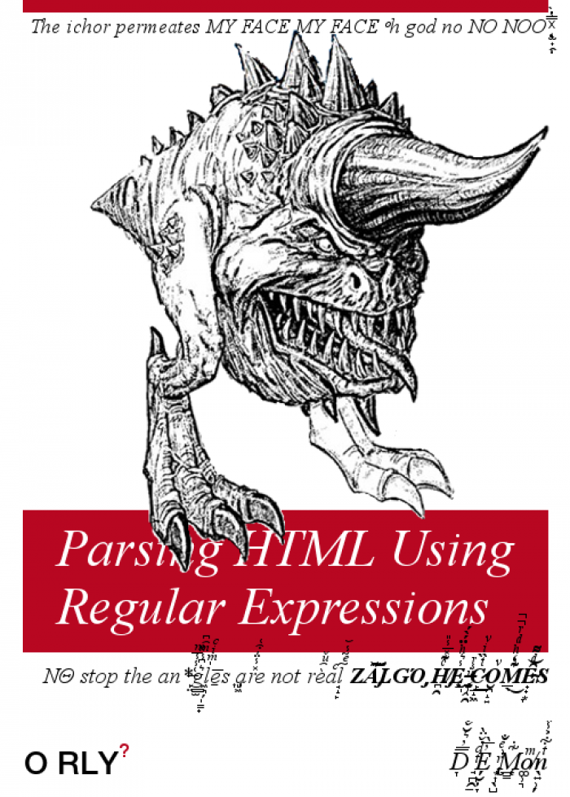

# Regex 101

<p style="text-align: center;">Henry Marshall</p>
<p style="text-align: center;">SEM.js</p>
<p style="text-align: center;">2019-03-11</p>

==========

## Splitting on Lines

```javascript
const unix_str = "foo\nbar"
unix_str.split("\n")
// => [ 'foo', 'bar' ]

const windows_str = "foo\r\nbar"
windows_str.split("\n")
// => [ 'foo\r', 'bar' ]
```

----------

## Repeating Characters

| Pattern   | Description             | Matches                      |
| --------- | ----------------------- | ---------------------------- |
| `a?`      | One or Zero 'a'         | '' 'a'                       |
| `a*`      | Zero or More 'a'        | '' 'a' 'aa' 'aaa' 'aaaa'...  |
| `a+`      | One or More 'a'         | 'a' 'aa' 'aaa' 'aaaa'...     |
| `a{3}`    | Exactly three 'a'       | 'aaa'                        |
| `a{2,4}`  | Two to four 'a'         | 'aa' 'aaaa' 'aaaa'           |

Note: Omitting the first and second numbers implicitly means 0 and infinite respectively.

----------

## Splitting on Lines

```javascript
const windows_str = "foo\r\nbar"
windows_str.split("\n")
// => [ 'foo\r', 'bar' ]

windows_str.split(/\r?\n/)
// => [ 'foo', 'bar' ]
```

==========

## Character Class

```javascript
const str = "My grandma has a cat. My grandpa has a dog."
str.replace(/???/g, "family")
```

Note: The `g` flag makes the regex global.

----------

## Character Class

```javascript
const str = "My grandma has a cat. My grandpa has a dog."
str.replace(/grand[mp]a/g, "family")
// => "My family has a cat. My family has a dog."
```

Note: The `g` flag makes the regex global.

----------
## Shorthand Character Class

| Shorthand | Equivalent      |
| --------- | --------------- |
| `[0-9]`   | `[0123456789]`  |
| `\d`      | `[0-9]`         |
| `\w`      | `[A-Za-z\d_]`   |
| `\s`      | `[ \t\n\r]`     |

Note: I can (and did) use `\d` inside another character class!

----------

## Negation

```js
const containsNonVowel = str => /???/.test(str)
containsNonVowel("foo")
// => true
```

----------

## Negation

```js
const isNotVowel = str => /[^aeiou]/.test(str)
containsNonVowel("foo")
// => true
```

----------

## Shorthand Negation

| Shorthand | Equivalent |
| --------- | ---------- |
| `.`       | `[^\r\n]`  |
| `\D`      | `[^\d]`    |
| `\S`      | `[^\s]`    |
| `\W`      | `[^\w]`    |

==========

## Crossword

TODO

==========

## Groups

```js
const isTheme = str => /???/.test(str)
isTheme("nanananananana Batman!")
// => true
```

----------

## Groups

```js
const isTheme = str => /(na)+ Batman/.test(str)
isTheme("nanananananana Batman!")
// => true
```

----------

## Alternation in Groups

```javascript
const str = "My brother has a ferret. My sister has a cat."
str.replace(/???/g, "family")
// => "My family has a ferret. My family has a cat."
```

----------

## Alternation in Groups

```javascript
const str = "My brother has a ferret. My sister has a cat."
str.replace(/(brother|sister)/g, "family")
// => "My family has a ferret. My family has a cat."
```

----------

## Backreferences

```javascript
const str = "My brother has a ferret."
str.replace(/???/g, "step-\1")
// => "My step-brother has a ferret."
```

Note: Backreferences are 1-indexed

----------

## Backreferences

```javascript
const str = "My brother has a ferret."
str.replace(/(brother|sister)/g, "step-\1")
// => "My step-brother has a ferret."
```

Note: Backreferences are 1-indexed

----------

## Capture Groups

```js
const str = "Stripe costs 2.9% + $0.30"
const reg = /???/
const getPercentage = str => str.match(reg)[1]
getPercentage(str)
// => "2.9"
```

Note: To include `%`, move it inside the capture group

----------

## Capture Groups

```js
const str = "Stripe costs 2.9% + $0.30"
const reg = /(100|\d{1,2}(\.\d+)?)%/
const getPercentage = str => str.match(reg)[1]
getPercentage(str)
// => "2.9"
```

Note: To include `%`, move it inside the capture group

==========

## JavaScript is Weird

```javascript
"bar baz".match(/ba\w/)    
// => [ "bar", index: 0, input: "bar baz",
//      groups: undefined ]
"bar baz".match(/ba(\w)/)  
// => [ "bar", "r", index: 0 input "bar baz", 
//      groups: undefined ]
"bar baz".match(/ba\w/g)   // => [ "bar", "baz" ]
"bar baz".match(/ba(\w)/g) // => [ "bar", "baz" ]
"bar baz".match(/foo/)     // => null
"bar baz".match(/foo/g)    // => null
```

Note: 
- I hereafter omit `groups: undefined`
- xRegExp library simplifies this and adds other features

----------

## `.exec` maintains an index
```javascript
const allMatches = (reg, str) => {
  let match
  const output = []
  while (match = reg.exec(str)) {
    output.push(match);
  }
  return output
}
allMatches(/ba(\w)/g, "bar baz") 
// => [ [ 'bar', 'r', index: 0, input: 'bar baz' ],
//      [ 'baz', 'z', index: 4, input: 'bar baz' ] ]
```

Note: Do *not* define the regex in the while loop or you'll have an infinite loop. It also *must* be a global regex. We'll reuse this function later.


==========

## Sometimes `.` is not enough

```javascript
extract_comment = /\/\*([\w\W]+)\*\//
contains_comment = `this.bit.is.code()
/* this is a comment
this too */
more.code()`
contains_comment.match(extract_comment)[1].strip
// => "this is a comment\nthis too"
```

This is what [your](https://github.com/mooz/js2-mode/blob/master/js2-mode.el#L6160) [syntax](https://github.com/isagalaev/highlight.js/blob/master/src/highlight.js#L756) [highlighter](https://github.com/pangloss/vim-javascript/blob/master/syntax/javascript.vim#L202) [is](https://github.com/Benvie/JavaScriptNext.tmLanguage/blob/master/JavaScriptNext.tmLanguage#L70) [doing](https://github.com/atom/language-javascript/blob/master/grammars/javascript.cson#L1890)!

----------

## Other times `.` is too much

```javascript
const foo = 'foo="foo"'
foo.match(/"(.+)"/g)
// => [ [ '"foo"', "foo", index: 6, input: 'foo = "foo"' ] ]

const foobar = 'foo="foo",bar="bar"'
allMatches(/"(.+)"/g, foobar)
// => [ [ '"foo", bar="bar"','foo", bar="bar', index: 4,
//      input: 'foo="foo", bar="bar"' ] ]

allMatches(/"([^"]+)"/g, foobar)
// => [ [ '"foo"', "foo", index: 4, 
//        input: 'foo="foo",bar="bar"' ],
//      [ '"bar"', "bar", index: 14, 
//        input: 'foo="foo",bar="bar"' ] ]
```

Note: 
- Think about the interpretter
- You can make the regex engine lazy with `?`

==========

## Crossword

TODO

==========

## Matching Email Addresses

TODO include tools for other languages

- [Rubular](http://rubular.com) [Ruby]

----------

## Matching Email Addresses

```regex
/[\w.%+-]+@[A-Z0-9.-]+\.[A-Z]{2,}/i
```

| Section          | Meaning                                         |
| ---------------- | ----------------------------------------------- |
| `[\w.%+-]+`      | 1+ of: letter, number, `.`, `_`, `%`, `+`, `-`  |
| `@`              | Literal `@`                                     |
| `[A-Z0-9.-]+`    | 1+ of: letter, number, `.`, `-`                 |
| `\.`             | Literal `.`                                     |
| `[A-Z]{2,}`      | Two or more letters                             |
| `i`              | Case Insensitive                                |

Note: 
- Escaping metacharacters was unnecessary inside char class.
- Not uncommon for regex to reject my personal email.

----------

## Matching the Whole String

```javascript
const codeInjection = 
  "<script>alert('uh oh')</script>\nfoo@bar.com"

const containsEmail = str => 
  /[\w.%+-]+@[A-Z0-9.-]+\.[A-Z]{2,}/i.test(str)
containsEmail(injection) // true

const containsOnlyEmail = str =>
  /^[\w.%+-]+@[A-Z0-9.-]+\.[A-Z]{2,}$/i.test(str)
containsOnlyEmail(injection) // false
```

Note: Ruby treats as multi-line by default -- use `\A` & `\z`. If you *want* that behavior, use multiline flag `m`.

==========

## `^`'s various meanings

```javascript
const isFirstCharacterVowel = str => /^[aeiou]/i.test(str)
const containsNonVowel = str => /[^aeiou]/i
```

----------

## `?`'s various meanings

```javascript
const optionalPercent = /\d+%?/
const nonCapturingGroup = /(100|\d{1,2}(?:\.\d+)?)%/
const lazyInterpretter = /"(.+?)"/
```

----------

## Metacharacters

```plaintext
\ ^ $ . | ? * + ( ) [ ] { }
```

Note:
- Over-escaping not a problem
- You *may* escape in character classes.

----------

## Regex Often Fail Silently

```javascript
const reg = /[abc]{2}[xyz]/
reg.test("cbz")     // true
reg.test("axx")     // false
reg.test("a")       // false

const typo = /[abc}{2}[xyz]/
```

----------

## Regex Often Fail Silently

```javascript
const reg = /[sem]+[js]/
reg.test("cbz")     // true
reg.test("axx")     // false
reg.test("a")       // false

const typo = /[abc}{2}[xyz]/
typo.test("cbz")    // true
typo.test("axx")    // true
typo.test("a")      // true
typo.test("[")      // true
typo.test("2")      // true
```

==========

## Where to use RegEx

Note: Your code, your config files, your editor

----------

## Your word processor


----------

## Chrome via DeepSearch


----------

## The Command Line

TODO something something grep
TODO something something ag

----------

[](https://stackoverflow.com/questions/1732348/regex-match-open-tags-except-xhtml-self-contained-tags)

==========

## Wrapping Up

----------

## Flavors of Regex

- Backreferences are by either:
  - `\1 \2` (Javascript, Perl, Python)
  - `$1 $2` (Ruby, Rust, PHP, Java)
  - `%1 %2` (Clojure)
- Basics are ~universal across languages
- Some advanced features vary (e.g., lookarounds, named references)

----------

## Resources

- TODO This deck
- TODO Your Handout
- [github.com/aloisdg/awesome-regex](https://github.com/aloisdg/awesome-regex)
- [Regular-Expressions.info](https://www.regular-expressions.info/)
- [Jeff Atwood's ode to regex]((https://blog.codinghorror.com/regular-expressions-now-you-have-two-problems/)

----------

## Next Steps

- [Non-Capturing Groups](https://stackoverflow.com/a/3513858/1884044)
- [Laziness](https://www.regular-expressions.info/repeat.html)
- [Lookarounds](https://www.regular-expressions.info/lookaround.html)
- [xRegExp](http://xregexp.com/) for Unicode, Backreferences, Named Groups, Syntactic Sugar, and more

----------

[](https://xkcd.com/1313/)

[Regex golf with Peter Norvig](https://www.oreilly.com/learning/regex-golf-with-peter-norvig)

----------

## Regex Crosswords

- [Original MIT Crossword](https://gregable.com/p/regexp-puzzle.html)
- [RegexCrossword.com](https://regexcrossword.com/) Web App
- [Regex Xword](https://play.google.com/store/apps/details?id=com.ilit.regexxword&hl=en_US) Android App

----------

## Thanks

Henry Marshall
Engineer at Stripe
henry@stripe.com
henry@isagoddamn.ninja

==========

## Crossword

- TODO Select characters for questions
